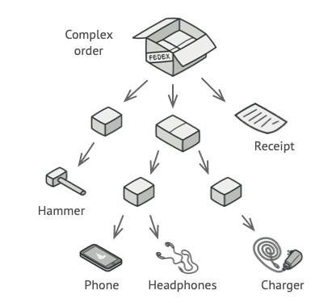

# Structural Design Pattern : Composite

<i>Source : <a href="https://refactoring.guru/design-patterns/composite">refactoring.guru</a></i>

The Composite Design Pattern is a structural pattern that organizes objects into tree structures (GeeksforGeeks). There are 3 component :
1. Base Component - Base component is the interface for all objects in the composition, client program uses base component to work with the objects in the composition. It can be an interface or an abstract class with some methods common to all the objects.
2. Leaf - Defines the behaviour for the elements in the composition. It is the building block for the composition and implements base component. It doesn’t have references to other Components.
3. Composite - It consists of leaf elements and implements the operations in base component.

Let's go back to the picture above that i got from refactoring.guru, i think this picture perfectly explaining how composite design pattern look a like which leaf symbolized as a thing (hammer, phone, etc) and composite symbolized as box. __In real world scenaryo just imagine a file system. In file system, there are a folder which can containing a file (as leaf) or another file (composite)__

__Note :__ In `dp_composite_1.py` folder1 should be a different object type than the composite.